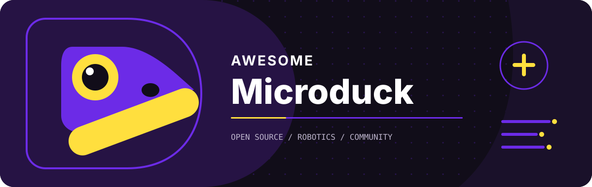

  

# Awesome Microduck

  
A curated directory of the Microduck open-source ecosystem, organized with Duckio's current information architecture and tags.

  
<a href="README.md">English</a> · <a href="README.zh-CN.md">简体中文</a>

  
  

## Contents

- [Policies](#policies)
  - [Locomotion](#policies-locomotion)
  - [Agility](#policies-agility)
  - [Manipulation](#policies-manipulation)
  - [Recovery](#policies-recovery)
- [Hardware](#hardware)
  - [Accessories](#hardware-accessories)
  - [Parts & Mods](#hardware-parts-mods)
  - [Robots](#hardware-robots)
- [Learn](#learn)
  - [Reference](#learn-reference)
  - [Tutorial](#learn-tutorial)
- [Resources](#resources)
  - [Registries](#resources-registry)
  - [Simulators](#resources-simulator)
  - [Tools & CLI](#resources-tool)
  - [Apps & Ports](#resources-app)
  - [Datasets](#resources-dataset)
  - [Training](#resources-training)
  - [Benchmarks](#resources-benchmark)
  - [Agent Tools & MCP](#resources-agent-tool)
- [News](#news)
  - [Media](#news-media)
- [Community](#community)
  - [Community](#community-community)
- [Tag Guide](#tag-guide)
- [Contributing](#contributing)
- [Related Repositories](#related-repositories)

> Microduck is an open-source biped robot by Pollen Robotics and Hugging Face. This list is independently maintained by the community and is not affiliated with or endorsed by either company.

## Policies

> Deployable behaviors and task definitions. (35)

### Locomotion

- [microduck-policies](https://huggingface.co/pollen-robotics/microduck-policies) - The ten official ONNX policies as a standalone Apache-2.0 repository on the Hugging Face Hub, described by one schema-2 manifest.json, with velstand the default walk since 14 September. `official` `open-source` `onnx`
- [microduck-walking yaw ablation](https://github.com/alertform/microduck-walking) - Single-variable reward ablation that cuts yaw-rate variance against the released alpha_walking baseline, with the evaluation harness that makes the comparison reproducible. Sim-only. `sim-only` `open-source` `community`
- [microduck-moonwalk-backward](https://huggingface.co/fffiloni/microduck-moonwalk-backward-55e6af) - Backward moonwalk gait on the Hugging Face Hub. `community`
- [More policies on the Hub](https://huggingface.co/models?search=microduck) - The growing long tail of community-trained gaits and gestures, searchable on the Hugging Face Hub. `community`
- [MicroDuck skills for TorchRL](https://huggingface.co/torchrl/microduck-skills) - One recurrent task-conditioned policy covering seven skills (stand, four directions, turn each way) through a task embedding and a 128-unit GRU, trained on 12 million transitions across 16 native CPU environments, with all 56 evaluation episodes surviving the full horizon. Published by the TorchRL project, which also states its known limits: the head still drops about 63 degrees walking backward, and turns reach roughly two thirds of the commanded rate. Sim-only. `sim-only` `open-source` `community`
- [microduck-swing](https://huggingface.co/HannesVonEssen/microduck-swing) - Starts motionless at the bottom of a two-cord swing and pumps itself with its head and legs to a 173 degree span, with 71 of 100 randomized seeds clearing every full-horizon validity gate and rollouts rejected for cord slack, lateral drift or attachment misalignment rather than judged on angle alone. Printable seat and straps included. Sim-only. `sim-only` `community`
- [microduck-stilts](https://huggingface.co/HannesVonEssen/microduck-stilts) - Eight forward-walking policies for stilts from 10 cm to 2 metres, each height its own ONNX graph, continuation checkpoint, manifest and video behind a machine-readable index, with the printable stilt hardware alongside. Sim-only. `sim-only` `hardware-ready` `onnx` `community`
- [microduck-running](https://huggingface.co/HannesVonEssen/microduck-running) - Running policy robustified from a 1.687 m/s speed frontier with velocity pushes, centre-of-mass variation and initial tilt, holding 1.651 m/s nominal and 1.612 m/s under a combined backlash and disturbance battery. The author calls it a hardware candidate and says heading and lateral drift remain substantial. Sim-only. `sim-only` `hardware-ready` `community`
- [microduck-happy-hop](https://huggingface.co/joanfox/microduck-happy-hop) - Short two-foot hop that crouches, takes off, absorbs the landing and returns home, and one of the first community policies shown running on a physical MicroDuck, after Pollen restored the one-step action delay it depends on. The card states that delay alongside the rest of the contract. `community`
- [microduck-rl running](https://github.com/zhoumiaosen/microduck-rl) - Training repository with 39 registered tasks and a published straight-running policy holding 1.844 m/s over 10 seconds and 1.806 m/s over 30 under a heading-hold controller, stating plainly that the 2.0 m/s target was not met. Sim-only. `sim-only` `open-source` `community`
- [rough-walk-e](https://huggingface.co/RemiFabre/microduck-rough-walk-e) - Drop-in replacement for alpha_walking fine-tuned on a hostile-terrain ladder of tiles, small stairs, rubble and slopes, with roughly half the falls; the from-scratch rough-walk-g is sturdier on stairs and slopes at 17 percent more motor power. Stated limits include falling on downward steps of 2 cm or more. Sim-only. `sim-only` `open-source` `community`
- [microduck-tricks](https://huggingface.co/langli11/microduck-tricks) - Three skills trained on Hugging Face Jobs and scored on held-out batteries against the shipped policies: a run into a forward roll that hands off from walking 200 times out of 200 where the official policy manages 86 percent, a cone slalom that clears 8 of 8 gates without a fall where the official policy clears 21 percent, and a one-foot skate that lifts a blade for 0.4 to 0.6 seconds of true single support and skates on, 24 takes without a fall. A sustained one-blade glide is reported as unreachable on this robot, with the measured ceiling. Sim-only. `sim-only` `community`
- [microduck-onefoot-skate](https://github.com/hikarioyama/microduck-onefoot-skate) - Interim checkpoint on a sustained left-foot glide, published as method and measurements rather than as a result: the declared 2.0 second gate is cleared by only 1 episode in 64 and no stage has passed formal acceptance, but 96.9 percent hold a credible one-foot glide past 1.0 second and the best recorded is 2.14 seconds. Carries the learnable-authority audit that found 35 percent of every episode had nothing to learn, two spawn-state defects traced to wheel velocities in the observation, all 15 training runs as curves, signed decision records, and an ONNX path documented well enough to drive the policies without installing MuJoCo. Sim-only. `sim-only` `open-source` `onnx` `mujoco`
- [microduck-move-a-low-crouch-walk](https://huggingface.co/tfrere/microduck-move-a-low-crouch-walk) - Microduck Academy policy for continuous low-crouch walking, published with ONNX weights, a fine-tunable checkpoint, recorded trajectories, lineage metadata and a passing rollout judge. `sim-only` `open-source` `onnx` `community`
- [microduck-rough-walk-g](https://huggingface.co/RemiFabre/microduck-rough-walk-g) - From-scratch rough-terrain gait that trades higher motor power for stronger stair-and-slope robustness than the author's fine-tuned rough-walk-e policy. `sim-only` `open-source` `onnx` `community`

### Agility

- [microduck-backflip](https://github.com/Lulzx/microduck-backflip) - Reproducible mjlab backflip task with an evaluation battery, experiment log and explicit safety gates. Sim-only. `sim-only` `open-source` `community`
- [Jump playground](https://github.com/Liyucheng1997/318_lab-microduck-simulator) - Browser sandbox fork with a custom-trained vertical-jump policy; live demo. Sim-only. `sim-only` `open-source` `browser` `community`
- [microduck-sidekick-dance](https://github.com/pezzonovante7/microduck-sidekick-dance) - Drop-in mjlab task for a lateral dance step, with reward design notes. Task only, not yet trained. `open-source` `community`
- [Microduck Circus](https://github.com/ros-claw/microduck) - Three ducks learn to skip a shared long rope, two turning and one jumping, through an act-fail-practice-adapt agent loop with a holdout round. Sim-only. `sim-only` `open-source` `community`
- [microduck-flamingo-cycle](https://huggingface.co/RemiFabre/microduck-flamingo-cycle) - One-legged flamingo pose policy on the Hugging Face Hub. `community`
- [microduck-polite-bow](https://huggingface.co/fffiloni/microduck-polite-bow-b1d864) - Bow gesture policy on the Hugging Face Hub. `community`
- [microduck-climb](https://huggingface.co/HannesVonEssen/microduck-climb) - A climbing policy and a get-up policy for a desk ladder, with full checkpoints, hashes and printable ladder parts. The switch between them reads simulator contact rather than an onboard detector, and the ladder parts are geometry-checked but not yet printed or load-tested. Sim-only. `sim-only` `community`
- [Collision Flamingo II](https://huggingface.co/Teethyfish/microduck-collision-flamingo-ii) - One-foot balance trained against a full exterior-shell collision model, shipped with the exact overlay needed to reproduce it. It works through the ONNX deployment rehearsal but not through the training repository's own play viewers, and the card reports that discrepancy as unresolved. Sim-only. `sim-only` `onnx` `community`
- [MicroDuck Jump](https://github.com/chenp9527/microduck-jump) - Raises happy-hop's band to an in-place hop of 3 to 6 cm on stock servos, with the checkpoint chosen by in-band rate rather than by recency: over 128 episodes half land inside the band and none fall. Its own acceptance checklist records the failure as well, a 128 N landing peak against a 40 N target, with the fix identified but not yet validated. Sim-only. `sim-only` `open-source` `community`
- [microduck-detector](https://huggingface.co/pngwn/microduck-detector) - YOLO11n detector that finds a Microduck in an image, 2.6M parameters, scored at 0.63 mAP50 on a held-out split of synthetic renders and real press photos; try it in what-the-microduck. `community`
- [microduck-electric-slide-policy](https://huggingface.co/Histochemichael/microduck-electric-slide-policy) - Experimental Electric Slide controller combining the official walk with count-conditioned joint biases; its card publishes physics traces and failed quality gates instead of claiming a finished dance policy. `sim-only` `onnx` `mujoco` `community`

### Manipulation

- [microduck-courier](https://github.com/selinayfilizp/microduck-courier) - Pick-carry-place task in an apartment scene with a trained policy, rollout clip and telemetry. Sim-only. `sim-only` `open-source` `community`
- [microduck-max-height-jump](https://github.com/ThomasBurgess2000/microduck-max-height-jump) - Deployable ONNX export and reproducibility evidence for a one-shot PPO jump, with the height claim stated as a training objective rather than a physical maximum. Sim-only. `sim-only` `open-source` `onnx` `community`
- [microduck-basketball](https://huggingface.co/HannesVonEssen/microduck-basketball) - Balances on a free-rolling size-7 basketball and follows velocity commands from proprioception alone, through a one-layer LSTM with no ball state in the actor inputs. Simulation and export checks pass; onboard timing and real-robot behavior are untested. `community`
- [Microduck RL 4096x6000](https://huggingface.co/Datawhale/Microduck-RL-4096x6000) - Velocity-tracking reproduction pinned to an upstream commit: 4096 parallel environments, 6000 PPO iterations, with intermediate checkpoints, the ONNX export, training config, TensorBoard events and closed-loop replay video all kept, and a matching ball-kick run keeps the same record. Sim-only. `sim-only` `open-source` `onnx` `community`
- [MicroDuck BallKick 4096x6000](https://huggingface.co/Datawhale/Microduck-BallKick-4096x6000) - Separately published Microduck ball-kick training run using 4,096 parallel environments and 6,000 PPO iterations, with training artifacts and an ONNX export. `sim-only` `open-source` `onnx` `community`
- [Microduck Vision Soccer](https://github.com/toyhank/microduck-vision-soccer) - Autonomous MuJoCo soccer stack using RGB head-camera frames and proprioception to find, approach and aim at a ball, then execute a bundled ONNX kick through physical contact. `sim-only` `open-source` `onnx` `mujoco`

### Recovery

- [microduck-step-up-policy](https://github.com/bihaokun/microduck-step-up-policy) - Policy pair for crossing a 25 mm square-edged step using the head as a temporary brake, then recovering upright; weights on the Hub. Sim-only. `sim-only` `open-source` `community`
- [beak-throw](https://github.com/llama/microduck-beak-throw) - Winds up, throws a 24 mm ball from the beak and recovers to a stand as a one-shot skill, with weights on the Hub. It completed 50 of 50 randomized trials only with a mandatory runtime clamp and failed the stricter raw-output gate, and a safety note governs any first hardware run. Sim-only. `sim-only` `hardware-ready` `open-source` `community`
- [microduck-standup](https://huggingface.co/QingMuLYL/microduck-standup) - Episodic get-up that runs for six seconds and returns itself to a standing pose, published against manifest schema 2 with its robotctl policy add line and its training branch and commit named. The card also admits the export came from a checkout with uncommitted changes. Sim-only. `sim-only` `open-source` `community`

## Hardware

> Robots, accessories, parts and fabrication. (21)

### Accessories

- [OpenMicroDuck](https://github.com/SaberOnGo/open-microduck) - Independent reverse-engineering and documentation project mapping what the robot contains and how its stack works, in English and Chinese, explicit that the hardware is not open source. `hardware-ready` `open-source` `bilingual` `community`
- [microduck-replica-cad](https://github.com/fanhao375/microduck-replica-cad) - The companion drawing set for that reconstruction: 56 editable SolidWorks parts and assemblies rather than meshes, plus a 21-page assembly manual, modelled from scratch by a named author. In Chinese. `open-source` `chinese` `community`
- [microduck-hardware-replica](https://github.com/lingzolabs/microduck-hardware-replica) - FreeCAD multi-part assemblies, printable meshes and a planning-stage bill of materials derived from the public MJCF and STL models. In Chinese, and explicit that it is unaffiliated and unverified. `hardware-ready` `open-source` `chinese` `community`
- [Microduck build tutorial](https://github.com/AI-FanGe/Microduck-build-tutorial) - End-to-end build of a working small biped on a Raspberry Pi Zero 2 W: wiring, a flashable image, Wi-Fi and SSH setup, printable files, the deployment code that drives the Dynamixel bus from an ONNX gait, and the mjlab environment that trains it. Walking hardware on video. In Chinese. `hardware-ready` `open-source` `chinese` `onnx`
- [Microduck DIY build docs](https://github.com/wslengzhicheng/microduck-diy) - Documentation companion to that build: bill of materials, printing, wiring, phased assembly, servo and IMU commissioning and first walk, with the software left upstream. Apache-2.0, in Chinese. `open-source` `chinese` `community`
- [Microduck Replica Kit](https://github.com/qianen6/microduck-replica-kit) - Evidence-traceable reconstruction package that separates upstream facts from reproducible derivations and open questions, with an assembly exporter for the 47 public meshes and a staged bill of materials. Walking hardware is not finished. In Chinese. `hardware-ready` `open-source` `chinese` `community`
- [Fanduck](https://github.com/7757/fanduck) - A finished replica, with photographs and video of a working duck built from parts sourcing through printing to assembly, and the maker pack mirrored alongside: bill of materials, print files, board files and a 3D pose workbench. Its licence file pins the upstream commit everything derives from and flags the official mechanical model as non-commercial. In Chinese. `open-source` `chinese` `community`
- [RPI Robot HAT](https://github.com/pollen-robotics/elec_RPI_Robot_HAT) - Official KiCad 9 design for a Raspberry Pi Zero-sized robot HAT with IMU, TTL and RS-485 servo buses, audio I/O and Qwiic expansion, used by Microduck reconstruction projects. `official` `hardware-ready` `open-source`

### Parts & Mods

- [microduck-diy](https://github.com/ScrapMeta/microduck-diy) - Month-long build log for a hand-made duck from the public simulation meshes and printable parts, with staged files and a parts list. In Chinese. `open-source` `chinese` `community`
- [OpenMicroDuck (FreeCAD)](https://github.com/MengyangGao/OpenMicroDuck) - FreeCAD model and engineering drawings alongside a keyboard-driven MuJoCo simulation with walking, sitting and standing, fall recovery and jaw control, plus ramp and low-grip test scenes. Apache-2.0, in Chinese and still iterating; unrelated to the reverse-engineering project of the same name above. `open-source` `chinese` `mujoco` `community`
- [MicroDuck BoBoRedesign](https://github.com/AiBoBoMaker/MicroDuck-BoBoRedesign) - Work-in-progress redesign of the Microduck shell and structure for FDM/SLA printing, organized for printable STL/STEP parts, PCB, firmware and reinforcement-learning assets. `hardware-ready` `open-source` `community`
- [BruzMicroduck CAD](https://github.com/BruzWJ/BruzMicroduck_CAD) - Compact CAD repository for a Microduck replica adapted around off-the-shelf sensors, boards and components, separating official reference geometry from editable replica-specific STEP designs. `hardware-ready` `open-source` `community`

### Robots

- [microduck-replica](https://github.com/fanhao375/microduck-replica) - Reconstruction study deriving assembly and exploded drawings, CAD-importable assemblies, a fastener list and an electronics teardown (Radxa Zero 3W, TTL servo bus, the two custom boards) from the public MJCF, STL meshes and runtime source, in English and Chinese and not verified against physical hardware. `hardware-ready` `open-source` `bilingual` `community`
- [ChinaMicroDuck](https://github.com/Shiyao-Huang/ChinaMicroDuck) - Replication reference library: four costed manufacturing routes compared, an audit of which official assets may be reused under which license, environment verification reports and Chinese translations of the official docs. `open-source` `community`
- [Microduck Replica Lab](https://github.com/tachytelicdetonation/microduck-replica-lab) - Assembly explorer, a rehearsal of the published walking policy, reference CAD, build instructions and US and China sourcing guides. Code is Apache-2.0 while reference geometry stays under CC BY-NC-SA with a license map, and the project says it is not a tested kit. `open-source` `community`
- [microduck_imu_to_ttl](https://github.com/avanx/microduck_imu_to_ttl) - Open-hardware imu_to_dxl board putting an LSM6DSV16X on the half-duplex Dynamixel bus, with its own regulation and transceiver buffering, schematic and block diagram published and the project also on OSHWHub. Fills one of the parts the replica projects list as still to be designed. Apache-2.0, in Chinese. `hardware-ready` `open-source` `chinese` `community`
- [Open Duck Mini](https://github.com/apirrone/Open_Duck_Mini) - The open-hardware predecessor: BOM, CAD, and the original mjlab training work. `hardware-ready` `open-source` `community`
- [Open Duck Mini Runtime](https://github.com/apirrone/Open_Duck_Mini_Runtime) - Raspberry Pi runtime for Open Duck Mini. `open-source` `community`
- [microduck_runtime (legacy)](https://github.com/TommyZihao/microduck_runtime) - Pre-launch Raspberry Pi runtime for the Microduck prototype; superseded by pollen-robotics/microduck. `official` `open-source`
- [microduck_maploc_rs](https://github.com/apirrone/microduck_maploc_rs) - Time-of-flight submap SLAM, relocalization and A\* planning in Rust, written by a Pollen engineer for the prototype duck runtime. The runtime it targets is not public; the crate is. `open-source` `community`
- [OptiDuck](https://github.com/sim336/OptiDuck) - Physical Microduck-derived biped using a Radxa Zero 3W and lower-cost Feetech bus servos, with MuJoCo/mjlab PPO training, ONNX deployment, board services and an Android maintenance app. `hardware-ready` `open-source` `chinese` `onnx`

## Learn

> Authoritative references and task-oriented tutorials. (12)

### Reference

- [Docs index](https://github.com/pollen-robotics/microduck/blob/main/docs/README.md) - Map of every doc in the repo. `official` `open-source`
- [Cheat sheet](https://github.com/pollen-robotics/microduck/blob/main/docs/robot/cheatsheet.md) - robotctl commands for day-to-day use of the robot. `official` `open-source`
- [Architecture](https://github.com/pollen-robotics/microduck/blob/main/docs/design/architecture.md) - How the daemons, control loop, policies and updater fit together. `official` `open-source`
- [Design docs](https://github.com/pollen-robotics/microduck/tree/main/docs/design) - robotd, updater, remote WebRTC, boot recovery, restart order and the WebRTC console. `official` `hardware-ready` `open-source`
- [Policy channel design](https://github.com/pollen-robotics/microduck/blob/main/docs/design/policy-channel-design.md) - How community policies reach robots from the Hub: slots, the origin rule, and the reasoning behind the manifest. `official` `open-source`
- [Policy manifest](https://github.com/pollen-robotics/microduck/blob/main/docs/policy-manifest.md) - The schema-2 manifest.json contract: what each field means, and why only a constant-command episodic policy can become a one-shot skill. `official` `open-source`
- [Roadmap](https://github.com/pollen-robotics/microduck/blob/main/docs/project/roadmap.md) - Milestones M1–M9, including the Hub model channel (M8) and autonomous brain (M9). `official` `open-source`
- [duckctl](https://github.com/pollen-robotics/microduck/blob/main/docs/robot/duckctl.md) - Controlling the robot from a laptop over Bluetooth. `official` `open-source`
- [Pair a gamepad](https://github.com/pollen-robotics/microduck/blob/main/docs/robot/pair-a-gamepad.md) - Bonding a controller to the robot. `official` `open-source`
- [Dev board setup](https://github.com/pollen-robotics/microduck/blob/main/docs/robot/install-dev.md) - Setting up a development board and pushing branches. `official` `open-source`
- [Contributing guide](https://github.com/pollen-robotics/microduck/blob/main/CONTRIBUTING.md) - Upstream contribution standards. `official` `open-source`

### Tutorial

- [MicroDuck Startup](https://github.com/superobk/microduck-startup) - Executable Chinese two-day bootcamp covering the official simulator, microduck_rl tests, a PPO smoke run, CUDA training, 61-to-14 ONNX export and native MuJoCo deployment rehearsal. `sim-only` `open-source` `chinese` `onnx`

## Resources

> Reusable datasets, simulators, tools, apps and registries. (106)

### Registries

- [pollen-robotics/microduck](https://github.com/pollen-robotics/microduck) - The robot's software: robotd 50 Hz control loop, mediad camera/WebRTC, padd gamepad, updater, the official policy set and the robotctl policy channel that installs community policies from the Hub. `official` `hardware-ready` `open-source`
- [Policy Playground](https://huggingface.co/spaces/pollen-robotics/microduck-policy-playground) - Official Space that reads every microduck- policy on the Hub the way the robot reads it and installs one onto your duck in one click, through the same calls robotctl policy add makes. `official` `browser`
- [microduck-plugin](https://github.com/acnlabs/microduck-plugin) - Agent Plugins package that gives Cursor, Copilot, Codex, VS Code or Kiro the train, export, publish-to-Hub and install loop as a single skill. MIT, with continuous integration. `open-source` `community`
- [MicroduckHub](https://microduckhub.com) - Community policy browser listing the shipped behaviors and Hub retrains, with one-click deploy planned for when upstream's model channel ships. `browser` `community`
- [uDuck Registry](https://uduck-registry.pages.dev) - Independent catalog of community policy descriptors with contract specs and verification status. `community`

### Simulators

- [pollen-robotics/microduck_rl](https://github.com/pollen-robotics/microduck_rl) - RL training environments on mjlab (MuJoCo Warp) with PPO, BAM actuator models, backlash simulation and domain randomization. Needs a CUDA GPU. `official` `open-source` `mujoco`
- [Microduck Sandbox](https://huggingface.co/spaces/pollen-robotics/microduck-simulator) - Official in-browser simulator: MuJoCo compiled to WebAssembly plus onnxruntime-web running the real policies at 50 Hz, with gamepad support and the roller-skate variant. `official` `browser` `onnx` `mujoco`
- [microduck-rl-genesis](https://github.com/Macmachi/microduck-rl-genesis) - Genesis port of the walking task for AMD/ROCm GPUs, actuator model validated bit-exact against upstream. Sim-only. `sim-only` `open-source` `community`
- [Isaac Lab Microduck port](https://github.com/5usu/IsaacLab/blob/microduck-port/source/isaaclab_microduck/docs/README.md) - Isaac Lab extension with Microduck assets, BAM/backlash actuators and RSL-RL tasks for walking, kicking and parkour. Sim-only. `sim-only` `open-source` `isaac` `community`
- [isaaclab-microduck (Newton)](https://github.com/kabilankb/isaaclab-microduck) - Isaac Lab 3.0 (Newton MJWarp) port with locomotion, running, ball-kick and two-robot rally tasks, each A/B'd against the mjlab baseline. Sim-only. `sim-only` `open-source` `isaac` `community`
- [microduck-ros2-isaac](https://github.com/osrbot/microduck-ros2-isaac) - Tutorial for driving the public Microduck model from ROS 2 Jazzy and NVIDIA Isaac Sim, with joint control in RViz and the released walking policy in USD. Sim-only. `sim-only` `open-source` `ros2` `isaac`
- [microduck-ai-world](https://github.com/shaibuafeez/microduck-ai-world) - Embodied-AI playground pairing a robot runtime and RL policies with a detailed MuJoCo world and a vision-language brain that stays off the control loop. Sim-only. `sim-only` `open-source` `mujoco` `community`
- [microduck-sim-playground](https://github.com/x10zyn/microduck-sim-playground) - Lightweight educational workspace: bootstrap script, CPU MuJoCo viewer with keyboard poses, upstream pinned as submodules. `open-source` `browser` `mujoco` `community`
- [microduck-rl-lab](https://github.com/AlexandreEDMOND/microduck-rl-lab) - Retrains five official skills and composes them into one automatic MuJoCo obstacle course. Sim-only. `sim-only` `open-source` `mujoco` `community`
- [microduck-miniverse](https://github.com/DollhouseRobotics/microduck-miniverse) - Every published ONNX policy repackaged as a deterministic Miniverse simulation bundle. `open-source` `onnx` `community`
- [Microduck RL Ball Follow](https://github.com/yangyihai/Microduck_RL_Ball_Follow) - MuJoCo Warp training repo adding a target-following task, a command-block contract layer and a drag-the-ball demo. Sim-only. `sim-only` `open-source` `mujoco` `community`
- [Wicroduck](https://github.com/ngxson/wicroduck) - Attempt to put the whole loop behind a URL: MuJoCo compiled to WebAssembly steps the real MJCF in the browser with no Python and no backend. Simulation works today; in-browser training is the goal, not yet the state. Sim-only. `sim-only` `open-source` `browser` `mujoco`
- [MicroDuck Unity Sim2Sim](https://github.com/sgyli7/MicroDuck-Unity-Sim2Sim) - Runs the official MJCF and ONNX policies inside Unity/Tuanjie with native MuJoCo kept as the physics authority and Barracuda doing inference, so the engine owns only scene, input and rendering. A Godot/Jolt counterpart now also runs the roller variant and a second robot in one window. Non-commercial use only, per the model license. Sim-only. `sim-only` `open-source` `onnx` `mujoco`
- [MicroDuck Swan Lake](https://github.com/jjshdbndg/microduck-motrixsim) - Trains a walking policy in the MotrixSim simulator, then blends it per joint with open-loop choreography (policy on the legs, choreography on the head and neck) for a two-minute ballet with a written root-cause log. In Chinese. Sim-only. `sim-only` `open-source` `chinese` `community`
- [mjlab-sycl](https://github.com/guang384/mjlab-sycl) - Companion package that gets mjlab's CUDA-only path training on an Intel integrated GPU or Arc card without editing your project: install it into the same environment and run one overlay command. Apache-2.0, with continuous integration. Sim-only. `sim-only` `open-source` `community`
- [microdux](https://github.com/noahfarr/microdux) - JAX and MJX port of the training stack to MuJoCo Playground, with all fourteen official tasks registered for registry.load and the reward set checked term by term against upstream on a frozen transition. Sim-only. `sim-only` `open-source` `mujoco` `community`
- [microduck-mjbatch](https://github.com/tailong-wu/microduck-mjbatch) - Trains on the CPU alone through mjbatch, thousands of MuJoCo instances stepped in a C++ thread pool: a walking policy solved in 2 hours 36 minutes on 8 vCPU with zero falls, and a ball-balance task reported as half-solved, with a median survival of 2.03 seconds and 78 percent of episodes still ending in a fall. Sim-only. `sim-only` `open-source` `mujoco` `community`
- [microduck_genesis](https://github.com/green-creeper/microduck_genesis) - Genesis World physics as a drop-in for the official stack: a TCP duck-body server the real daemons attach to with --sim, and an interactive viewer for rehearsing exported ONNX policies by keyboard. Apache-2.0. Sim-only. `sim-only` `open-source` `onnx` `community`
- [joeynyc/microduck-mcp](https://github.com/joeynyc/microduck-mcp) - Agent-agnostic MCP server modeled on the real-robot robotd architecture: mock, MuJoCo sim, Unix-socket and SSH transports behind one tool set, with a safety layer. Hardware transports are pre-validation. `hardware-ready` `open-source` `mcp` `mujoco`
- [aj-dev-smith/microduck-mcp](https://github.com/aj-dev-smith/microduck-mcp) - MCP server driving the simulated duck (CPU MuJoCo with the official policies), with rendered camera frames as tool output and a live agent-experience debug page. Sim-only. `sim-only` `open-source` `mcp` `mujoco`
- [quackd](https://github.com/rokbenko/quackd) - Agent CLI that began as the brain daemon the duck was missing, named after its own services: register robots once, then state a goal in plain language and Claude, OpenAI, Gemini or Grok sequences each robot's existing skills, alone or as a flock. .duck task files, safety rules, MCP support, on PyPI. It now drives seven robots, all in simulators or mocks so far. `open-source` `mcp` `community`
- [Strands Robots Microduck provider](https://strands-labs.github.io/robots/policies/microduck/) - Python/MuJoCo provider wrapping the shipped ONNX policies behind a common simulation and hardware interface. `hardware-ready` `open-source` `onnx` `mujoco`
- [MicroDuck TinyVLA](https://huggingface.co/spaces/AlexWortega/microduck-vla-simulator) - Vision-language-action model driving a live MuJoCo duck from a head-camera frame, the 61-float state and a plain-English instruction, all on ONNX Runtime CPU. Sim-only. `sim-only` `browser` `onnx` `mujoco`
- [microduck-cli](https://github.com/agentculture/microduck-cli) - Same verbs for an agent and for a human: five noun groups over robotd's own JSON-RPC socket, --json on every command, and an empty runtime dependency list. On PyPI; checked against the real daemon and the MuJoCo body. `hardware-ready` `open-source` `mujoco` `community`
- [microduck_demo_part1](https://github.com/hjianbo/microduck_demo_part1) - Drives the official walking policy in MuJoCo over MQTT through a small adapter, with upstream pinned as submodules and a one-script bootstrap; motor control and inference are left untouched. Sim-only. `sim-only` `open-source` `mujoco` `community`
- [Jevduck](https://github.com/amazedsaint/jevduck) - Browser research simulator asking whether a model can choose useful next actions from measured robot state while a separate controller keeps execution bounded, and keeping an accepted instruction and the physical result it actually produced as separate events. MuJoCo WebAssembly with the official policies, a live build and a validation record. Sim-only. `sim-only` `open-source` `browser` `mujoco`
- [microduck-sim (iPhone)](https://github.com/littlejohntj/microduck-sim) - The nine shipped policies plus MuJoCo running natively on iPhone in Swift/RealityKit, with an AR mode at true scale. `open-source` `mujoco` `community`
- [Microduck AR](https://huggingface.co/spaces/multimodalart/microduck-ar) - WebXR adaptation of the official sandbox with AR placement and ground-pick interaction. `browser` `community`
- [MicroDuckModels](https://github.com/IronSpiderMan/MicroDuckModels) - Browser simulator rebuilt on Three.js and React Three Fiber with MuJoCo WebAssembly physics and local ONNX inference, running all nine shipped policies. Readme in Chinese and English. `open-source` `chinese` `bilingual` `browser`
- [RL Physics Overlay](https://github.com/carpentry-liu/rl-physics-overlay) - Dependency-free telemetry overlay for the browser simulator showing joint forces, torques, contacts and learning signals without blocking the training loop. In Chinese and English. `open-source` `chinese` `bilingual` `browser`
- [Microduck Studio](https://github.com/microai-lab/microduck-studio) - Local control room that puts robotd status, safe control and the MuJoCo body behind one browser page, deliberately duplicating none of the safety, inference or physics it fronts. Readme in English and Chinese. `hardware-ready` `open-source` `bilingual` `browser`
- [Microduck Arena](https://github.com/00make/microduck-arena) - Three-a-side reinforcement-learning football in the browser on MuJoCo WebAssembly and onnxruntime-web, with a playable site. MIT, readme in English and Chinese. Sim-only. `sim-only` `open-source` `bilingual` `browser`
- [microduck-viewer](https://github.com/MACRL2/microduck-viewer) - Runs a trained locomotion policy as plain JavaScript at 50 Hz with no inference runtime at all, against MuJoCo WebAssembly physics, as embeddable pages for an interactive control textbook. No server, no build step. Sim-only. `sim-only` `open-source` `browser` `mujoco`
- [Microduck Academy](https://github.com/kingsleyli920/microduck-academy) - Staged reinforcement-learning classroom for software engineers new to the field: read the task, write Python, run real tests and watch the result, all on one page, ending in the official 3D simulator. Independent and explicit about it. In Chinese and English. `open-source` `chinese` `bilingual` `community`
- [microduck-docker](https://github.com/srayuth089/microduck-docker) - The simulator, MuJoCo physics and the pretrained policies in a single published container, so trying the robot is one docker run rather than an environment. Apache-2.0, built in CI and on Docker Hub. `open-source` `mujoco` `community`
- [Microduck Color Studio](https://github.com/LathamZ/microduck-color-studio) - Colors and materials per part across the 70 instances of the simulation assembly, then exports a color-preserving multi-plate 3MF and per-part STLs for printing. Apache-2.0 code with the model's own provenance kept in its notice, and a live version. In Chinese and English. `open-source` `chinese` `bilingual` `community`
- [Bohemian Rhapsody by the Microducks](https://huggingface.co/spaces/FormaLau/microduck-bohemian-rhapsody) - Four ducks perform the operatic section in the browser simulator. Sim-only. `sim-only` `browser` `community`
- [MicroDuck Mommy Flock](https://huggingface.co/spaces/oliveirabruno01/microduck-mommy-flock) - Lead a mother duck while two ducklings learn to follow her, in a fork of the official sandbox that its author marks experimental, with simulated perception. Sim-only. `sim-only` `browser` `community`
- [Microduck and Reachy Mini Simulator](https://huggingface.co/spaces/FormaLau/microduck-reachy-simulator) - Both Pollen robots in one shared MuJoCo world in the browser, editable source included; a fork by a Pollen engineer adds the duck's real gamepad emotions and its own sounds. Sim-only. `sim-only` `browser` `mujoco` `community`
- [Duck on Desk](https://github.com/Happenmass/duck-on-desk) - Desktop companion that reacts to Claude Code, Codex, Pi and opencode, thinking while you prompt, walking while tools run and quacking when an agent needs approval, driven by the simulator rig and real walking policies rather than canned animation. Prebuilt for macOS and Windows, AGPL-3.0. `open-source` `community`
- [microduck-imx6ull](https://github.com/TonyRuan/microduck-imx6ull) - Specialises the ten shipped v5 policies into C and NEON for an i.MX6ULL board rather than porting a general ONNX runtime, then closes the loop with robotd on the real board while MuJoCo on a Mac supplies the sensors and motor response. Apache-2.0, in Chinese. `hardware-ready` `open-source` `chinese` `onnx`
- [Microduck Web](https://github.com/TonyRuan/microduck-web) - Browser simulator running the original MJCF, MuJoCo physics and eight ONNX policies entirely on the client, deployable as a plain static site with offline caching and no backend at all, with a live build. Apache-2.0, in Chinese. Sim-only. `sim-only` `open-source` `chinese` `browser`
- [Microduck Android](https://github.com/TonyRuan/microduck-android) - The real policies and MuJoCo physics running offline on a phone behind a touch joystick, walking, sitting, rolling and kicking, with a published APK and recordings from the device. Apache-2.0, in Chinese, and explicit that it is not an official port. Sim-only. `sim-only` `open-source` `chinese` `mujoco`

### Tools & CLI

- [pollen-robotics/microduck-gst-plugins](https://github.com/pollen-robotics/microduck-gst-plugins) - Prebuilt aarch64 GStreamer plugins (Rockchip MPP encoders, gst-plugins-rs WebRTC) used by the on-robot media daemon. `official` `hardware-ready` `open-source`
- [microduck-duck-detector](https://huggingface.co/pollen-robotics/microduck-duck-detector) - Official one-class detector that finds other ducks in a duck's own camera, shipped as PyTorch, ONNX and INT8 RKNN for the robot's NPU and run on board by duck-detect. Scored at 0.80 mAP50, with every training run kept as a Git tag. `official` `onnx`
- [pollen-robotics/duck_detector](https://github.com/pollen-robotics/duck_detector) - The Apache-2.0 pipeline behind that model: capture, label, train and quantize, end to end. `official` `open-source`
- [Robot Reel / Microduck Motion Lab](https://github.com/noteflowai/robot-reel) - Replay and evidence toolkit for recorded physical-AI experiments, including two Microduck policy walks with source samples, action and joint traces, offline checks and editable 3D exports. `open-source` `browser` `community`

### Apps & Ports

- [Microduck Console](https://huggingface.co/spaces/pollen-robotics/microduck-console) - Official hosted console for driving a duck that is not on your own network, over WebRTC and Hugging Face sign-in. `official` `browser`
- [Vision demo](https://huggingface.co/spaces/pollen-robotics/microduck-vision-demo) - Official Space that takes the duck's camera feed and runs the processing on Hugging Face hardware instead of on the robot. `official` `hardware-ready` `browser`
- [microduck-lab (Apple Silicon)](https://github.com/jonathanhawkins/microduck-lab) - Trains policies on a Mac with no CUDA GPU, against the same MJCF model and 61/14 contract as upstream, with a live browser viewer. Sim-only. `sim-only` `open-source` `browser` `community`
- [Microduck RL one-click toolkit](https://github.com/OneRobotAI/microduck) - Two scripts that take a bare Linux box from no environment to a usable gait and an exported ONNX with its validation, timed at about four hours on an RTX 5060 Ti. In Chinese. Sim-only. `sim-only` `open-source` `chinese` `onnx`
- [microduck_rl_unilab](https://github.com/rocPAI-Forge/microduck_rl_unilab) - Runs the upstream tasks on the UniLab distribution without depending on its source, pinned to upstream commit 29e887e with an alignment contract and an audit script that checks the port has not drifted from it. Apache-2.0, in Chinese. Sim-only. `sim-only` `open-source` `chinese` `community`
- [microduck-locomotion-diagnosis](https://github.com/Qi-hub-dot/microduck-locomotion-diagnosis) - Reproduces the unanswered upstream issue #46, where the walking task converges to standing still, then finds three causes the reporter's seven experiments missed: the air-time reward pays out on whether a command exists rather than on whether the robot moves, lateral drift runs at twice the forward speed while both axes are weighted equally, and the headline metric mixes five terms. Gating the reward on achieved motion and weighting lateral error three times took error_vel_xy from 0.43 to 0.21. Also records what it took to run the CUDA-only stack on Windows. In Chinese. Sim-only. `sim-only` `open-source` `chinese` `community`
- [DuckKit](https://github.com/craigm26/duckkit) - The Microduck as a pure Swift package: runs the real ONNX policies with the real 61-float observation at 50 Hz, plus kinematics, protocol types and Linux tests. `open-source` `onnx` `community`
- [Microduck WebXR](https://github.com/ApurvK032/microduck-webxr) - Physics-driven Microduck for Meta Quest and ordinary browsers, with controller walking, learned skills, room placement and an autonomous wander mode. `open-source` `browser` `community`
- [Microduck Anatomy](https://huggingface.co/spaces/mishig/microduck-anatomy) - Interactive holographic anatomy viewer with staged component focus and exploded assembly views. `browser` `community`
- [microduck-tracking](https://github.com/AlexBodner/microduck-tracking) - Multi-object tracking on top of roboflow/trackers that gives the duck a target lock, so it fetches one thrown ball past identical distractors. `open-source` `community`
- [specs-microduck](https://github.com/kgediya/specs-microduck) - Hand-gesture teleoperation of the simulated duck from Snap Spectacles, with in-lens telemetry. `open-source` `community`
- [microquack](https://osolmaz.github.io/microquack/) - Procedural droid-voice synthesis for the duck: a Rust core rendered live in the browser via WebAssembly, also on Hugging Face. `open-source` `browser` `community`
- [Kinematic viewer](https://github.com/taherfattahi/microduck-rigid-body-kinematic-viewer) - Drag any joint through its real range and watch the chain follow, with axis, hard limits, trainable limits and home angle shown live. One index.html, no build step; also a hosted Space. `open-source` `browser` `community`
- [3D bipedal teleop](https://huggingface.co/spaces/hwihwalab/microduck-3d-bipedal-teleop) - Browser digital twin driven by the shipped policies over ONNX Runtime, with omnidirectional teleoperation and reported velocity-tracking error. In English and Korean. Sim-only. `sim-only` `browser` `onnx` `community`
- [esp-duck](https://github.com/xingxingRealzyx/esp-duck) - All nine shipped policies compiled onto an ESP32-S3 and hot-swappable at runtime, holding 50 Hz with roughly two times margin on per-channel INT8 weights and FP32 activations, fed by the board's own IMU, with a quantization-accuracy gate that runs on the host, on the device and at every boot. `open-source` `community`
- [spacemit-microduck](https://github.com/fivif/spacemit-microduck) - Brain swap to SpacemiT RISC-V: the official Rust runtime cross-compiled natively for K3 and K1 boards driving the servo bus directly, training left on the existing x86 and GPU chain. K3 measured; K1 still in progress. In Chinese. `open-source` `chinese` `browser` `community`
- [DuckFly](https://github.com/amazedsaint/duckfly) - Wires a simulated 668-neuron fly circuit to the duck: map any of 19 circuit signals to 10 robot actions in a wizard, then watch the neural activity and the resulting movement side by side. Runs locally in a browser or as a Mac app, with a hosted version. Sim-only. `sim-only` `open-source` `browser` `community`
- [FlyWire MicroDuck](https://huggingface.co/spaces/AlexWortega/flywire-microduck) - Couples a fixed spiking model of the whole released fly connectome, 139,255 neurons, to a trained walking policy; only an 84k-parameter readout from descending neurons is learned. Reaches 95 of 100 held-out goals without a fall, against 0 of 100 with the stimulation, the readout features or their identities removed. Sim-only. `sim-only` `browser` `community`
- [Microduck Racer](https://huggingface.co/spaces/Nirav-Madhani/microduck-racer) - Four roller-skating ducks race waypoints around a furnished dining room, a racing layer on top of the unchanged roller policy and observation contract. Sim-only. `sim-only` `browser` `community`
- [Microduck Playground Competition](https://huggingface.co/spaces/HandsomeWu666/Microduck-playground-competition) - Pick the winner of a two-lap race between three ducks, each running its own physics and policy in the browser, and win or lose fish on the result. Apache-2.0. Sim-only. `sim-only` `open-source` `browser` `community`
- [Duck-Man](https://github.com/nyle-prosal/duckman-microduck) - Maze tag for five ducks walking on the published gait, with a trained stand-up policy for tagged or fallen ducks and a strategy network evolved on a laptop CPU. Apache-2.0. Sim-only. `sim-only` `open-source` `community`
- [Quackify](https://huggingface.co/spaces/cat5v/microduck-songbook) - Four-part chorales sung in the duck's own voice from a MIDI file, using the robot's sounds crate compiled to WebAssembly, so a song that sounds right here should sound the same on the hardware. `hardware-ready` `browser` `community`
- [Microduck beak lab](https://github.com/qilinxiaoxiang/microduck-beak-lab) - Picks up, holds and drops an object with the beak, comparing a trained jaw policy with its untrained start and a scripted controller in the same scene; broader head and jaw learning is proposed, not done. Sim-only. `sim-only` `open-source` `community`
- [Try Micro Duck](https://trymicroduck.com/) - Unofficial browser playground running the official MuJoCo model and reinforcement-learning policies locally at 50 Hz, with camera-based hand and face interaction and no video upload. `sim-only` `browser` `onnx` `mujoco`
- [Microduck ROS 2 SLAM](https://github.com/YahyaLimbo/microduck_ros2_slam) - Apache-2.0 ROS 2 Jazzy workspace for Microduck mapping and localisation, deriving meshes and kinematics from the official microduck_rl assets. `open-source` `ros2` `community`

### Datasets

- [microduck-emotions](https://huggingface.co/datasets/pollen-robotics/microduck-emotions) - Official Apache-2.0 dataset of emotional body-language animations, published so the duck and Reachy Mini can act scenes together. `official` `open-source`
- [Policy golden vectors](https://huggingface.co/datasets/craigm26/microduck-policy-golden-vectors) - Observation and action pairs recorded from the shipped policies, so an independent runner can be checked against the same numbers. A conformance fixture, not weights. `community`
- [Trajectory dataset](https://huggingface.co/datasets/allen73/microduck-trajectory-dataset) - Multi-modal state-action trajectories from the 14-DOF simulated robot, aimed at offline reinforcement learning and imitation. Sim-only. `sim-only` `open-source` `community`
- [Microduck detection dataset](https://huggingface.co/datasets/pngwn/microduck-detection-dataset) - Labelled bounding boxes over synthetic renders, composites and real press photographs, the training and validation split behind the detector above. `community`
- [microduck-electric-slide-motion](https://huggingface.co/datasets/Histochemichael/microduck-electric-slide-motion) - Motion-reference and validation package for the experimental Electric Slide controller, containing joint trajectories, count-level quality checks, physics traces and failed-experiment provenance. `sim-only` `mujoco` `community`

### Training

- [microduck_description](https://github.com/adityakamath/microduck_description) - ROS 2 description package: URDF and xacro generated from the public model, with 38 visual meshes and a robot_state_publisher launch file. `open-source` `ros2` `community`
- [microduck-rl-on-thor](https://github.com/metahubaifeel/microduck-rl-on-thor) - Getting the official training stack to run on aarch64 CUDA hardware (Thor, DGX Spark, Jetson), with every trap documented and verified on real machines. In English and Chinese. `hardware-ready` `open-source` `bilingual` `community`
- [Microduck School](https://huggingface.co/spaces/ysharma/gr-workflow-microduck-school) - Hosted Space where you set a lesson in plain English and watch the duck fail, retry and improve while the score climbs. `browser` `community`
- [MicroDuck Playground](https://github.com/Vottivott/microduck-playground) - Independent continuation of microduck_rl collecting reproducible experiments, policy demonstrations and printable hardware add-ons, rebased on a pinned upstream commit. `hardware-ready` `open-source` `community`
- [microduck-rl-torch](https://github.com/bsprenger/microduck-rl-torch) - PyTorch-native rewrite of the training stack for machines without CUDA, with the same workflow carried up to an NVIDIA box or the cloud. Continuous integration and coverage on every commit. Sim-only. `sim-only` `open-source` `community`
- [microduck-move-base-walk](https://huggingface.co/tfrere/microduck-move-base-walk) - From-scratch retraining of the upstream velocity task with its checkpoint and configs for remixing, plus a side-by-side fidelity comparison against Pollen's shipped walking policy. `sim-only` `open-source` `onnx` `community`
- [Sarvoday Microduck Lab](https://github.com/sarvob/sarvoday-microduck-lab) - Reproducible challenge lab with machine-readable goals and pass/fail gates for high-level controllers over frozen official policies, including steering, ball pushing and skill handoffs. `sim-only` `open-source` `mujoco` `community`

### Benchmarks

- [microduck-lab](https://github.com/jvpflum/microduck-lab) - Reproducible training and evaluation workspace for NVIDIA DGX Spark that pins the official runtime, simulator and microduck_rl as submodules. `open-source` `browser` `community`
- [isaaclab_microduck (PhysX)](https://github.com/dreamerarun/isaaclab_microduck) - Full port of the official training stack to IsaacLab and PhysX: 37 environments across walking, collision, roller, backlash and testbench models, BAM M6 actuator dynamics, PPO configs and ONNX export. The published checkpoint is an integration smoke test, not a converged gait. Sim-only. `sim-only` `open-source` `onnx` `isaac`
- [duckbench](https://github.com/craigm26/duckbench) - The physics bench under the golden vectors and the scored challenges: MuJoCo plus the shipped policies behind an HTTP service, a WebAssembly phone build, and the same bench exposed as MCP tools. Every published number names the plant it was measured in. `open-source` `browser` `mcp` `mujoco`
- [RDK Robot Learning Platform](https://github.com/D-Robotics/robot-learning-platform) - Vendor workbench from D-Robotics that takes a motion recorded in the browser simulator through training, evaluation and a pre-flight check toward its RDK-X5 board, all under one model contract. The local worker is a mock by default; the real training back end and board agent plug in through adapters. In Chinese. `open-source` `chinese` `browser` `community`
- [MotrixLab MicroDuck rollers](https://github.com/jjshdbndg/MotrixLab-MicroDuck) - Passive-roller skating environment for MotrixLab built around alternating push-off cycles, heading control and recovery after contact, with a bundled checkpoint, a deterministic evaluation script and reward regression tests. In Chinese and English. Sim-only. `sim-only` `open-source` `chinese` `bilingual`
- [microduck_rl_tutorial](https://github.com/rocPAI-Forge/microduck_rl_tutorial) - Beginner's Jupyter lab for omnidirectional velocity training on AMD ROCm, running from reinforcement-learning fundamentals through a smoke run, a train-from-scratch of about four minutes on an MI300X, an evaluation against a bundled reference checkpoint and keyboard teleoperation. MIT. Sim-only. `sim-only` `open-source` `community`
- [Microduck Carpet Lab](https://github.com/yuecui0130-create/microduck-carpet-lab) - Configuration dashboard and training adapter for walking on compliant, variable-friction ground, laying out the observation and action contract, PPO settings and reward terms on a static site that can also recompute an imported evaluation report. States plainly that it ships no trained policy and that its contact model approximates carpet rather than simulating fibres. MIT. Sim-only. `sim-only` `open-source` `community`
- [Microduck Ball Challenge](https://huggingface.co/datasets/craigm26/microduck-ball-challenge) - Scored ball-chasing benchmark with the physics plant pinned by hash; a stairs challenge follows the same discipline. Sim-only. `sim-only` `community`
- [Microduck Stairs Challenge](https://huggingface.co/datasets/craigm26/microduck-stairs-challenge) - Simulation-only, hash-pinned benchmark for getting Microduck upright onto a step, with a reproducible MuJoCo scorer, robustness grid, leaderboard, saved intents and documented negative results. `sim-only` `open-source` `mujoco` `community`
- [MicroDuck Embodied](https://github.com/SoryuElvars/microduck-embodied) - Evaluation and navigation project around the official locomotion policy, covering tracking and fall metrics, dynamics sensitivity, go-to-goal control and a high-level navigator over a frozen gait. `sim-only` `open-source` `chinese` `onnx`

### Agent Tools & MCP

- [meckie-duck-gateway](https://github.com/rangerchaz/meckie-duck-gateway) - Holds the robot's WebRTC/JSON-RPC session and re-exposes it as a small local HTTP API, with a hardware-free protocol double for testing. `hardware-ready` `open-source` `community`
- [OpenCastor Microduck integration](https://docs.opencastor.com/robots/microduck/) - Third-party robot-agent framework that discovers Microducks, sends intents through robotd and composes routines. `hardware-ready` `community`
- [Microduck Lab (gr.Workflow)](https://huggingface.co/spaces/ysharma/gr-workflow-microduck-lab) - Hosted Space that turns a plain-English routine into a sequence of the robot's skills through a language model, then plays it back. `browser` `community`
- [quacksat](https://github.com/andreagenovese/quacksat) - Turns the duck into a roaming voice satellite, with interchangeable Home Assistant Wyoming, agent-bridge and direct backends selected from one config file. `open-source` `community`
- [microduck-remote-policy-server](https://github.com/lukegao209/microduck-remote-policy-server) - Experimental server for running policy inference off the robot at 50 Hz: it checks each ONNX against the 61/14 contract and stays silent for a network it did not load, so robotd falls back to its local copy. Pairs with an experimental branch of a runtime fork. `hardware-ready` `open-source` `onnx` `community`
- [Harboria](https://github.com/Harboria/harboria) - Rust runtime for an assistant that holds long-term context and decides when to intervene, rather than answering one request at a time, with the duck as its first adapter. Apache-2.0 and early: the domain model and daemon are there, the robot side is not yet exercised on hardware. `hardware-ready` `open-source` `community`
- [Jev drives a MicroDuck](https://github.com/miguelaeh/jev-microduck) - Replaces the gamepad with a typed-judgment model that sees only the head camera rendered as characters and picks the next move about every 150 ms, leaving the 50 Hz locomotion policy untouched. Sim-only. `sim-only` `open-source` `community`

## News

> Official updates, ecosystem stories and media coverage. (20)

### Media

- [Product page](https://pollen-robotics.com/microduck) - Specs, colorways and the launch story. `official`
- [Store](https://store.pollen-robotics.com/products/microduck) - Pre-orders at $399. `official`
- [Press kit](https://pollen-robotics.com/microduck/press-kit/) - Facts, full spec sheet, photos and downloads. `official`
- [Meet Microduck](https://pollen-robotics.com/microduck/blog/introducing-microduck/) - Launch blog post from Pollen Robotics. `official`
- [TechCrunch](https://techcrunch.com/2026/08/27/hugging-face-is-selling-a-cute-399-open-source-duck-robot-microduck/) - Launch coverage. `open-source` `community`
- [WhatDuck](https://duck.whatled.com) - Learning site for the replication effort: four handbooks, a thirty-lesson course and two hundred deep readings of the official code and hardware, with the site source and content published together. In Chinese. `hardware-ready` `chinese` `community`
- [Engadget](https://www.engadget.com/2245407/huggingface-and-pollen-robotics-opn-pre-orders-for-the-microduck-robot/) - Pre-order details and specs. `official`
- [The Register](https://www.theregister.com/ai-and-ml/2026/08/27/hugging-face-offers-399-robot-duck-to-help-you-quack-the-ai-code/5293011) - Launch coverage with a developer angle. `community`
- [The New Stack](https://thenewstack.io/hugging-face-microduck-robot/) - Why the duck is a reinforcement-learning teaching platform. `community`
- [IEEE Spectrum](https://spectrum.ieee.org/video-friday-microduck-robot) - Video Friday feature. `community`
- [Digital Trends](https://www.digitaltrends.com/cool-tech/pollen-robotics-microduck-aims-to-make-training-physical-ai-far-less-fragile-and-cheaper/) - On making physical-AI training cheaper and less fragile. `official`
- [MarkTechPost](https://www.marktechpost.com/2026/08/28/pollen-robotics-hugging-face-microduck-399-open-source-rl-biped-robot/) - Technical summary of the RL stack. `official` `open-source`
- [Interesting Engineering](https://interestingengineering.com/ai-robotics/new-robot-duck-learn-from-its-mistakes) - Overview of the robot's fall recovery and learning loop. `community`
- [Hacker News discussion](https://news.ycombinator.com/item?id=49462763) - Launch thread with 700+ points, including Pollen engineers answering questions. `community`
- [Pointcast 031](https://mhoydich.github.io/pointcast-microduck/) - Long-form feature on the hardware, the open stack and programming behavior with agents. `hardware-ready` `open-source` `community`
- [We made a new robot.](https://www.youtube.com/watch?v=RAtzEyGBGFU) - Official launch film from Pollen Robotics. `community`
- [Meet Microduck, the $399 Tiny Robot You Can Teach New Tricks](https://www.youtube.com/watch?v=reiTh7K4KSc) - Official product overview. `community`
- [Microduck Sim 2 Real](https://www.youtube.com/watch?v=szW7N_7B3tU) - Official side-by-side of policies in simulation and on the robot. `community`
- [Hugging Face Pushes Deeper Into Robotics With MicroDuck](https://www.youtube.com/watch?v=LF7GmLKgvcc) - Bloomberg Tech segment. `community`
- ['Microduck' robot enters growing market of AI toys](https://www.youtube.com/watch?v=i_IMO0knP3I) - Global News segment. `community`

## Community

> Places to meet, share, build and contribute. (4)

### Community

- [Pollen Discord](https://discord.com/invite/pollen-community-519098054377340948) - Official community server; the Microduck channels are where the team answers questions. `community`
- [Pollen Robotics on Hugging Face](https://huggingface.co/pollen-robotics) - Organization page hosting the sandbox Space and models. `official` `browser`
- [Pollen Robotics on YouTube](https://www.youtube.com/@PollenRobotics) - Official channel. `community`
- [@pollenrobotics on X](https://x.com/pollenrobotics) - Official account. `community`

## Tag Guide

| Tag | Meaning |
| --- | --- |
| `official` | Maintained or released by the official team |
| `community` | Community maintained |
| `sim-only` | Not yet validated on physical hardware |
| `hardware-ready` | Targets a physical robot or hardware |
| `open-source` | Public source is available |
| `chinese / bilingual` | Chinese content is available |
| `browser` | Runs in a web browser |
| `MCP / ONNX / MuJoCo / Isaac / ROS 2` | Primary technology |

## Contributing

Issues and pull requests are welcome. New entries should include a project link, a concise description, the appropriate category and relevant tags, and must be directly related to Microduck.

## Related Repositories

- [joeynyc/awesome-microduck](https://github.com/joeynyc/awesome-microduck) - Community-maintained Microduck list and the source catalog for this directory.
- [pollen-robotics/microduck](https://github.com/pollen-robotics/microduck) - The official open-source Microduck repository.
